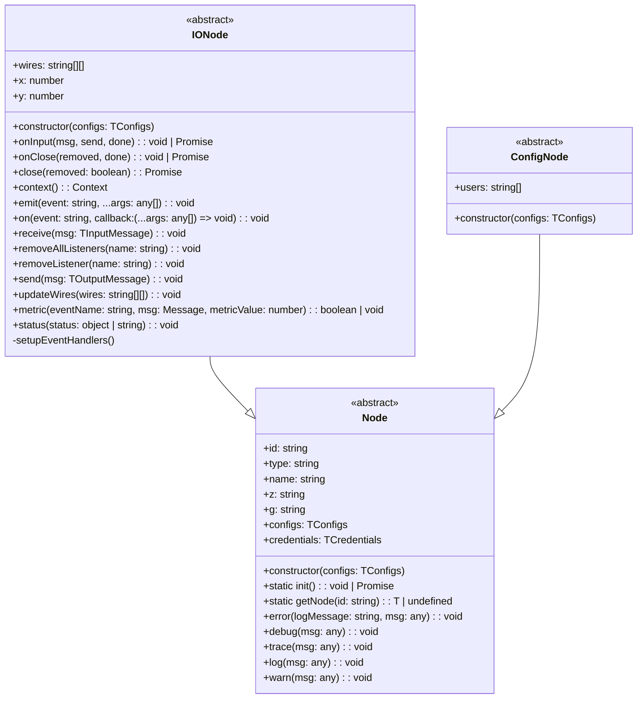

<p>
<a href="https://www.npmjs.com/package/node-red-vue-template" style="margin-right: 10px;"></a>
<a href="https://github.com/AllanOricil/node-red-vue-template/actions/workflows/ci.yaml"></a>
</p>

# node-red-vue-template

Build Node-RED nodes using:

- Vue 3
- JSON Schemas (V7 draft)
- Typescript
- ESM module system


## 💻 Dev Environment

| Dependency | Version  |
| ---------- | -------- |
| node       | v18.18.0 |
| node-red   | v4.0.9   |
| pnpm       | v10.11.0 |

## 📖 Guides

### 📚 How to build

```bash
pnpm install
pnpm build
```

### 📚 How to test

After building these nodes, install the `./dist` folder to your Node-RED instance:

```bash
cd ~/.node-red
npm install $PACKAGE_PATH/dist
```

## 🏛️ Architecture

### Why ajv + typebox instead of zod?

Ajv is much faster than zod for types and data validations. 

https://codetain.com/blog/benchmark-of-node-js-validators/#:~:text=Ajv%20turned%20to%20be%20the,2%20times%20faster%20than%20zod.


### Class Diagram



## 🤝 Contributing

I welcome contributions! If you'd like to help improve this template, feel free to open issues or submit pull requests. Your feedback is appreciated.

## 📜 License

This project is licensed under the [MIT License](https://github.com/AllanOricil/node-red-vue-template/blob/main/LICENSE).

## 💖 Become a Sponsor

If this CLI has made your life easier, consider supporting its development by clicking the button below.

<a href="https://www.buymeacoffee.com/allanoricil" target="_blank">
  
</a>
