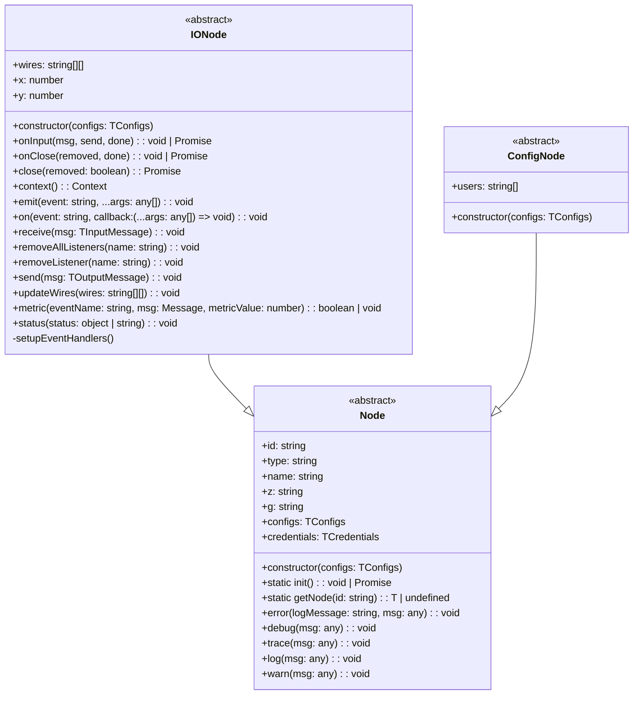

# node-red-vue-template

Build Node-RED nodes using:

- Vue 3
- JSON Schemas (V7 draft)
- Typescript
- ESM module system


### Dev Environment

| Dependency | Version  |
| ---------- | -------- |
| node       | v18.18.0 |
| node-red   | v4.0.9   |
| pnpm       | v10.11.0 |

### How to build

```bash
pnpm install
pnpm build
```

### How to test

After building these nodes, install the `./dist` folder to your Node-RED instance:

```bash
cd ~/.node-red
npm install $PACKAGE_PATH/dist
```

### Class Diagram


