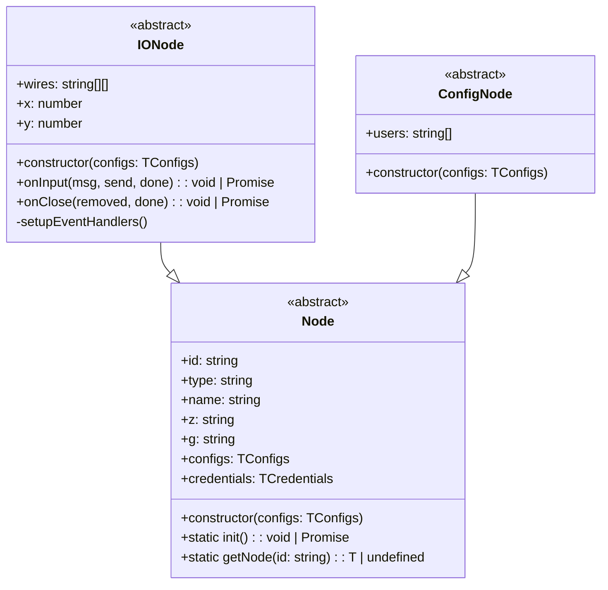

# node-red-vue-inputs-experiments

Build Node-RED nodes using:

- Vue 3
- JSON Schemas (V7 draft)
- Typescript
- ESM module system


### How to test

These nodes are already built to simplify testing. Just clone the repo and install it to your Node-RED instance.

```bash
cd ~/.node-red
npm install $PATH_WHERE_YOU_CLONED_THIS_REPO/dist
```

### Class Diagram


