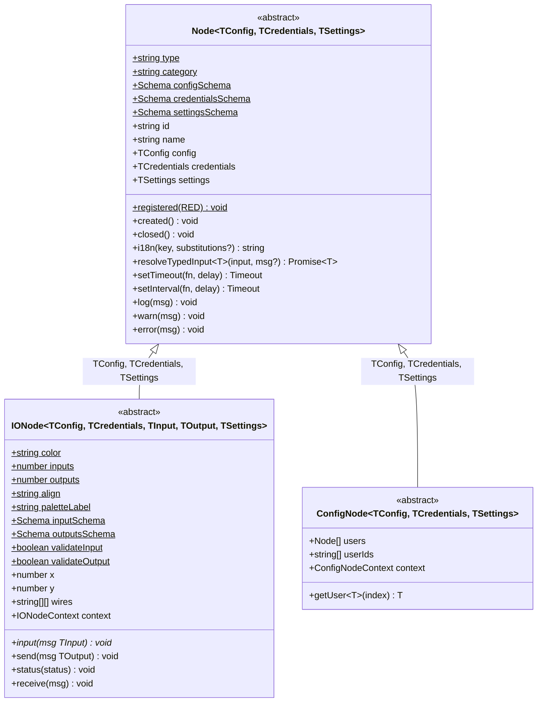

<p>
<a href="https://www.npmjs.com/package/node-red-vue-template" style="margin-right: 10px;"></a>
<a href="https://github.com/AllanOricil/node-red-vue-template/actions/workflows/ci.yaml"></a>
</p>

# node-red-vue-template

Build Node-RED nodes using Vue 3, TypeScript, and JSON Schema validation.


## Dev Environment

| Dependency | Version  |
| ---------- | -------- |
| Node.js    | >= 22    |
| pnpm       | >= 10.11 |

## Quick Start

```bash
pnpm install
pnpm dev        # start dev server with hot reload
pnpm build      # production build → ./dist
```

After building, install the `./dist` folder in your Node-RED instance:

```bash
cd ~/.node-red
npm install $PACKAGE_PATH/dist
```

## Architecture

### Folder Structure

The framework uses a convention-based directory layout under `src/`. The **server directory is required**; everything else is optional.

```
.
├── src/
│   ├── server/                    # REQUIRED — server-side node logic
│   │   ├── index.ts               # Entry: exports { nodes: [...] }
│   │   ├── nodes/
│   │   │   └── {type}.ts          # IONode or ConfigNode class
│   │   ├── schemas/
│   │   │   └── {type}.ts          # TypeBox schemas (config, credentials, input, output, settings)
│   │   └── tsconfig.json
│   │
│   ├── client/                    # OPTIONAL — client-side editor UI
│   │   ├── index.ts               # Optional entry for custom initialization
│   │   ├── components/
│   │   │   └── {type}.vue         # Custom form component (matched by node type)
│   │   ├── nodes/
│   │   │   └── {type}.ts          # Node definition overrides (hooks, button, label)
│   │   ├── public/                # Static files copied to dist/resources/
│   │   ├── assets/                # Processed by Vite (imported in components)
│   │   └── tsconfig.json
│   │
│   ├── icons/                     # Node palette icons
│   │   └── {type}.png
│   │
│   ├── locales/                   # Internationalization
│   │   ├── labels/
│   │   │   └── {type}/
│   │   │       └── {lang}.json
│   │   └── docs/
│   │       └── {type}/
│   │           └── {lang}.md      # or {lang}.html
│   │
│   └── examples/                  # Example flows (copied to dist/)
│       └── 01-example.json
│
├── vite.config.ts                 # Vite config with @bonsae/vite plugin
├── node-red.settings.ts           # Node-RED settings for dev server
├── package.json
└── tsconfig.json
```

`{type}` is the node type identifier (e.g., `my-node`). `{lang}` is one of the supported languages: `en-US`, `de`, `es-ES`, `fr`, `ko`, `pt-BR`, `ru`, `ja`, `zh-CN`, `zh-TW`. Documentation files can be `.md` (Markdown) or `.html`.

### Server Directory (Required)

The server directory contains your node logic. This is the only required part of the project.

#### `server/index.ts`

The entry point exports your node classes:

```typescript
import YourNode from "./nodes/your-node";
import RemoteServer from "./nodes/remote-server";

export default {
  nodes: [YourNode, RemoteServer],
};
```

#### `server/nodes/{type}.ts`

Each file exports a class extending `IONode` (for nodes with inputs/outputs) or `ConfigNode` (for configuration nodes):

```typescript
import { IONode, type RED, type Schema, type Infer } from "@bonsae/nrg/server";
import {
  ConfigsSchema,
  CredentialsSchema,
  InputSchema,
  OutputSchema,
  SettingsSchema,
} from "../schemas/your-node";

export type Config = Infer<typeof ConfigsSchema>;
export type Credentials = Infer<typeof CredentialsSchema>;
export type Input = Infer<typeof InputSchema>;
export type Output = Infer<typeof OutputSchema>;
export type Settings = Infer<typeof SettingsSchema>;

export default class YourNode extends IONode<
  Config,
  Credentials,
  Input,
  Output,
  Settings
> {
  static readonly type = "your-node";
  static readonly category = "function";
  static readonly color: `#${string}` = "#ffffff";
  static readonly inputs = 1;
  static readonly outputs = 1;

  static readonly configSchema: Schema = ConfigsSchema;
  static readonly credentialsSchema: Schema = CredentialsSchema;
  static readonly inputSchema: Schema = InputSchema;
  static readonly outputsSchema: Schema = OutputSchema;
  static readonly settingsSchema: Schema = SettingsSchema;

  static async registered(RED: RED) {
    // Called once when the node type is registered
  }

  created() {
    // Called when a node instance is created
  }

  async input(msg: Input) {
    // Handle incoming messages
    this.send({ processedTime: Date.now(), ...msg });
  }

  async closed() {
    // Cleanup when the node is removed or restarted
  }
}
```

#### `server/schemas/{type}.ts`

Schemas define the structure and defaults for your node's configuration, credentials, inputs, outputs, and settings using TypeBox + custom extensions:

```typescript
import { SchemaType, defineSchema } from "@bonsae/nrg/server";
import RemoteServerConfigNode from "../nodes/remote-server";

const ConfigsSchema = defineSchema(
  {
    name: SchemaType.String({ default: "your-node" }),
    remoteServer: SchemaType.NodeRef(RemoteServerConfigNode), // reference to another node
    myProperty: SchemaType.TypedInput(), // Node-RED typed input
    country: SchemaType.String({ default: "brazil" }),
    fruit: SchemaType.Array(SchemaType.String(), { default: ["apple"] }),
  },
  { $id: "YourNodeConfigsSchema" },
);

const CredentialsSchema = defineSchema(
  {
    password: SchemaType.Optional(
      SchemaType.String({
        default: "",
        format: "password",
        minLength: 8,
      }),
    ),
  },
  { $id: "YourNodeCredentialsSchema" },
);
```

`SchemaType` extends TypeBox's `Type` with:

| Method                          | Description                                                                  |
| ------------------------------- | ---------------------------------------------------------------------------- |
| `SchemaType.NodeRef(NodeClass)` | Reference to a config node. Resolves to the actual node instance at runtime. |
| `SchemaType.TypedInput()`       | Node-RED TypedInput widget (value + type selector).                          |

`defineSchema(properties, { $id })` creates a validated schema with a required `$id` for AJV caching.

### Node Lifecycle

The framework simplifies Node-RED's callback-based API into clean async methods. You never deal with `send`, `done`, or event listeners directly.

#### Lifecycle Hooks

```
registered(RED)  →  called once when the node type is registered (static method)
     ↓
created()        →  called when a node instance is created
     ↓
input(msg)       →  called for each incoming message
     ↓
closed()         →  called when the node is stopped or deleted
```

| Hook | Scope | Async | Description |
| --- | --- | --- | --- |
| `registered(RED)` | Static (class-level) | Yes | Runs once per type at startup. Use for one-time setup like connecting to external services. |
| `created()` | Instance | Yes | Runs after the node instance is fully constructed. Safe to use `this.config`, `this.context`, `this.send()`. |
| `input(msg)` | Instance | Yes | Runs for each incoming message. `done()` is called automatically when the function returns (or rejects). |
| `closed()` | Instance | Yes | Runs when Node-RED stops or the node is deleted. Timers created with `this.setTimeout`/`this.setInterval` are cleared automatically. |

#### How `input()` Simplifies Node-RED's API

In raw Node-RED, the input handler receives `(msg, send, done)` and you must call `done()` manually:

```javascript
// Raw Node-RED
this.on('input', function(msg, send, done) {
    try {
        // process message
        send(msg);
        done();
    } catch(err) {
        done(err);
    }
});
```

The framework handles this automatically:

```typescript
// NRG framework
async input(msg: Input) {
    // Just process and send. done() is called when this function returns.
    // If it throws, done(error) is called automatically.
    this.send({ result: "processed" });
}
```

- **`done()` is called automatically** when `input()` returns (or its promise resolves)
- **`done(error)` is called automatically** if `input()` throws (or its promise rejects)
- **`send` is handled by `this.send()`** — no need to receive it as a parameter

#### Sending Multiple Messages (Streaming)

You can call `this.send()` multiple times inside `input()` to emit messages incrementally. `done()` is only called after the function returns, so all messages are sent before the input is marked as complete:

```typescript
async input(msg: Input) {
    for (const item of msg.payload.items) {
        this.send({ payload: item });
    }
    // done() is called here automatically after the loop finishes
}
```

To exit early without processing further, just `return`:

```typescript
async input(msg: Input) {
    if (!msg.payload) return; // done() is still called automatically

    this.send({ payload: msg.payload.toUpperCase() });
}
```

#### `this.send()` Context Awareness

`this.send()` automatically uses the right underlying send mechanism:

| Context | Behavior |
| --- | --- |
| Inside `input(msg)` | Uses the per-message `send` provided by Node-RED (correct for Node-RED 1.0+ API) |
| Outside `input()` (timers, `created()`, etc.) | Falls back to `this.node.send()` |

#### Sending to Multiple Outputs

For nodes with multiple outputs, pass an array to `this.send()` where each element corresponds to an output port:

```typescript
// Node with 3 outputs
async input(msg: Input) {
    this.send([
        { payload: "output 1" },  // → first output
        { payload: "output 2" },  // → second output
        null,                      // → nothing on third output
    ]);
}
```

`outputsSchema` supports both single and per-port validation:

```typescript
// Single schema — validates every output message against the same schema
static readonly outputsSchema: Schema = OutputSchema;

// Per-port schemas — each output port has its own schema
static readonly outputsSchema: Schema[] = [Output1Schema, Output2Schema, Output3Schema];
```

| `outputsSchema` | `this.send()` call | Validation behavior |
| --- | --- | --- |
| Single `Schema` | `send(msg)` | Validates `msg` against the schema |
| Single `Schema` | `send([msg1, msg2])` | Validates each non-null element against the same schema |
| `Schema[]` | `send([msg1, msg2])` | Validates `msg[i]` against `schema[i]` |

#### Dynamic Outputs

To let users configure the number of outputs from the editor, include `outputs` in your config schema:

```typescript
const ConfigsSchema = defineSchema({
    name: SchemaType.String({ default: "my-node" }),
    outputs: SchemaType.Number({ default: 1, minimum: 1, maximum: 10 }),
}, { $id: "MyNodeConfigsSchema" });
```

Node-RED automatically updates the output ports when the user changes the value and deploys.

#### Automatic Timer Cleanup

Timers created with `this.setTimeout()` and `this.setInterval()` are automatically cleared when the node is closed. No manual cleanup needed:

```typescript
created() {
    // This interval is automatically cleared when the node is stopped
    this.setInterval(() => {
        this.send({ payload: Date.now() });
    }, 5000);
}
```

### Client Directory (Optional)

The entire `client/` directory is **optional**. When absent, the framework auto-generates everything:

- A form is rendered automatically from the JSON schema (dynamic form)
- Node types are registered with properties derived from server-side static class fields
- No manual wiring is needed

You only create client files when you want to **override** the auto-generated behavior.

#### `client/components/{type}.vue` — Custom Form Component

Create a Vue component named after the node type to replace the auto-generated form:

```vue
<!-- client/components/your-node.vue -->
<template>
  <div>
    <div class="form-row">
      <span class="nrg-label">Name</span>
      <NodeRedInput
        :value="node.name"
        @update:value="node.name = $event"
        :error="errors['node.name']"
      />
    </div>
    <div class="form-row">
      <span class="nrg-label">Server</span>
      <NodeRedConfigInput
        :value="node.remoteServer"
        type="remote-server"
        :node="node"
        prop-name="remoteServer"
        @update:value="node.remoteServer = $event"
        :error="errors['node.remoteServer']"
      />
    </div>
    <div class="form-row">
      <span class="nrg-label">Country</span>
      <NodeRedSelectInput
        :value="node.country"
        :options="countryOptions"
        @update:value="node.country = $event"
        :error="errors['node.country']"
      />
    </div>
  </div>
</template>

<script lang="ts">
import { defineComponent } from "vue";

export default defineComponent({
  props: {
    node: { type: Object, required: true },
    errors: { type: Object, required: true },
  },
  computed: {
    countryOptions() {
      return [
        { value: "brazil", label: "Brazil" },
        { value: "usa", label: "United States" },
      ];
    },
  },
});
</script>
```

The component receives these props:

| Prop     | Required | Description                                                                           |
| -------- | -------- | ------------------------------------------------------------------------------------- |
| `node`   | Yes      | Reactive node object. Mutate properties directly to update the node.                  |
| `errors` | Yes      | Validation errors keyed by path (e.g., `"node.name"`, `"node.credentials.password"`). |
| `schema` | No       | The JSON schema (config + credentials merged). Useful for building dynamic forms.     |

**Available form components** (globally registered, use directly in templates):

| Component            | Usage                                              |
| -------------------- | -------------------------------------------------- |
| `NodeRedInput`       | Text/number/password input                         |
| `NodeRedTypedInput`  | Node-RED TypedInput widget (value + type selector) |
| `NodeRedConfigInput` | Config node selector with create/edit dialog       |
| `NodeRedSelectInput` | Single or multi-select dropdown                    |
| `NodeRedEditorInput` | Code editor (JSON, CSS, JavaScript, etc.)          |

#### `client/nodes/{type}.ts` — Node Definition Overrides

Create a definition file when you need client-side hooks or behavior that can't be expressed in the server class:

```typescript
import { defineNode } from "@bonsae/nrg/client";

export default defineNode({
  type: "your-node",
  onPaletteAdd() {
    console.log("Node type added to palette");
  },
  onPaletteRemove() {
    console.log("Node type removed from palette");
  },
  button: {
    toggle: "enabled",
    onclick() {
      /* button clicked */
    },
    enabled() {
      return true;
    },
    visible() {
      return true;
    },
  },
  label() {
    return this.name || "My Custom Label";
  },
});
```

This is only needed for properties that have no server-side equivalent:

| Property          | Description                                                  |
| ----------------- | ------------------------------------------------------------ |
| `onPaletteAdd`    | Called when node type is added to the palette                |
| `onPaletteRemove` | Called when node type is removed from the palette            |
| `button`          | Adds a button to the node in the workspace                   |
| `label`           | Custom label function (overrides server-side `paletteLabel`) |
| `labelStyle`      | Custom label CSS style                                       |

Properties like `category`, `color`, `inputs`, `outputs`, and `icon` are read from the server class and don't need to be repeated here.

#### `client/index.ts` — Custom Entry Point

Create an entry file only if you need custom initialization code or want to control the registration order:

```typescript
// This is auto-generated if not provided.
// Only create it for custom setup logic.
import { registerTypes } from "@bonsae/nrg/client";
import remoteServer from "./nodes/remote-server";
import yourNode from "./nodes/your-node";

// Register in specific order (config nodes first)
registerTypes([remoteServer, yourNode]);
```

When this file is absent, the framework auto-registers all node types discovered from the server build.

### How Auto-Wiring Works

At build time, the framework scans the server bundle and the client directory to auto-wire everything:

```
Server Bundle                Client Directory (optional)
┌─────────────────┐          ┌─────────────────────────────────┐
│ NodeClass.type   │──────▶  │ components/{type}.vue?  → form  │
│ NodeClass.schema │──────▶  │ nodes/{type}.ts?  → hooks       │
│ NodeClass.color  │         │ index.ts?  → custom init        │
│ ...              │         └─────────────────────────────────┘
└─────────────────┘                      │
         │                               │
         ▼                               ▼
   ┌─────────────────────────────────────────────┐
   │ Auto-generated client registration:         │
   │  - Import schemas from virtual module       │
   │  - Import form components (if found)        │
   │  - Import node definitions (if found)       │
   │  - Generate minimal definitions (if not)    │
   │  - Call registerTypes([...])                 │
   └─────────────────────────────────────────────┘
```

**Convention**: files must be named after the node type (e.g., node type `"your-node"` → `components/your-node.vue`, `nodes/your-node.ts`).

### Class Diagram


```mermaid
classDiagram
    class Node~TConfig, TCredentials, TSettings~ {
        <<abstract>>
        +string type$
        +string category$
        +Schema configSchema$
        +Schema credentialsSchema$
        +Schema settingsSchema$
        +registered(RED) void$
        +string id
        +string name
        +TConfig config
        +TCredentials credentials
        +TSettings settings
        +created() void
        +closed() void
        +i18n(key, substitutions?) string
        +resolveTypedInput~T~(input, msg?) Promise~T~
        +setTimeout(fn, delay) Timeout
        +setInterval(fn, delay) Timeout
        +log(msg) void
        +warn(msg) void
        +error(msg) void
    }

    class IONode~TConfig, TCredentials, TInput, TOutput, TSettings~ {
        <<abstract>>
        +string color$
        +number inputs$
        +number outputs$
        +string align$
        +string paletteLabel$
        +Schema inputSchema$
        +Schema outputsSchema$
        +boolean validateInput$
        +boolean validateOutput$
        +number x
        +number y
        +string[][] wires
        +IONodeContext context
        +input(msg TInput) void*
        +send(msg TOutput) void
        +status(status) void
        +receive(msg) void
    }

    class ConfigNode~TConfig, TCredentials, TSettings~ {
        <<abstract>>
        +Node[] users
        +string[] userIds
        +ConfigNodeContext context
        +getUser~T~(index) T
    }

    Node <|-- IONode : TConfig, TCredentials, TSettings
    Node <|-- ConfigNode : TConfig, TCredentials, TSettings
```

### Build Pipeline

The Vite plugin runs two build phases:

```
vite build
  │
  ├─ Phase 1: Server Build
  │   ├─ Bundle src/server/ → dist/index.js (CommonJS)
  │   ├─ Generate dist/index.d.ts (rolled-up type declarations)
  │   └─ Generate dist/package.json
  │
  └─ Phase 2: Client Build
      ├─ Read server bundle to extract node definitions (schemas, types, colors...)
      ├─ Auto-detect client/components/{type}.vue and client/nodes/{type}.ts
      ├─ Build Vue components → dist/resources/index.[hash].js (ES module)
      ├─ Generate dist/resources/index.html (Node-RED editor template)
      ├─ Copy icons → dist/icons/
      └─ Bundle locales → dist/locales/
```

### Validation

Validation runs in three places:

| Where              | When                  | What                                                                     |
| ------------------ | --------------------- | ------------------------------------------------------------------------ |
| **Client editor**  | Every keystroke       | Config + credentials validated against JSON schema. Errors shown inline. |
| **Server startup** | Node instance created | Config and credentials validated. Settings validated once per type.      |
| **Runtime**        | Message input/output  | Input and output validated if toggle is enabled per node instance.       |

Input/output validation toggles appear automatically in the editor form when `inputSchema` or `outputsSchema` are defined on the node class. Users can enable them per node instance.

### Vite Configuration

```typescript
// vite.config.ts
import { defineConfig } from "vite";
import { nodeRed } from "@bonsae/vite";

export default defineConfig({
  plugins: [
    nodeRed({
      // All options are optional — defaults work for the standard directory layout
      nodeRedLauncherOptions: {
        runtime: {
          settingsFilepath: "./node-red.settings.ts",
          version: "5.0.0-beta.5", // Node-RED version for dev server
          port: 1880,
        },
        restartDelay: 1000,
      },
      serverBuildOptions: {
        srcDir: "./src/server",
        entry: "index.ts",
        types: true, // generate .d.ts
        nodeTarget: "node22",
      },
      clientBuildOptions: {
        srcDir: "./src/client",
        entry: "index.ts",
        format: "es",
      },
    }),
  ],
});
```

### Why AJV + TypeBox instead of Zod?

This framework validates data in two places: on the server (every message flowing through a node) and on the client (every keystroke in the editor form). Performance matters.

**AJV is significantly faster than Zod** for runtime validation. Benchmarks consistently show AJV validating 2-10x faster because it compiles schemas into optimized validation functions, while Zod interprets its schema definition on every call.

**TypeBox** provides the TypeScript type layer on top of JSON Schema. Unlike Zod (which invents its own schema format), TypeBox generates standard JSON Schema Draft 7 objects. This means:

- The same schema object works with AJV at runtime AND provides full TypeScript inference at compile time
- Schemas are plain JSON — they can be serialized, sent to the client, and used by any JSON Schema compliant tool
- No need to maintain separate type definitions and validation schemas

The combination gives us: type safety (TypeBox) + fast validation (AJV) + portability (JSON Schema).

## Contributing

Contributions are welcome! Feel free to open issues or submit pull requests.

## License

This project is licensed under the [MIT License](https://github.com/AllanOricil/node-red-vue-template/blob/main/LICENSE).
